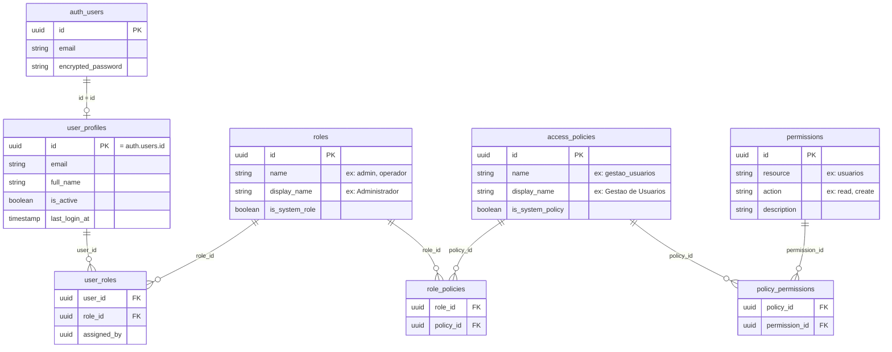
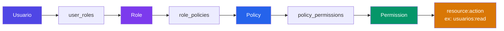
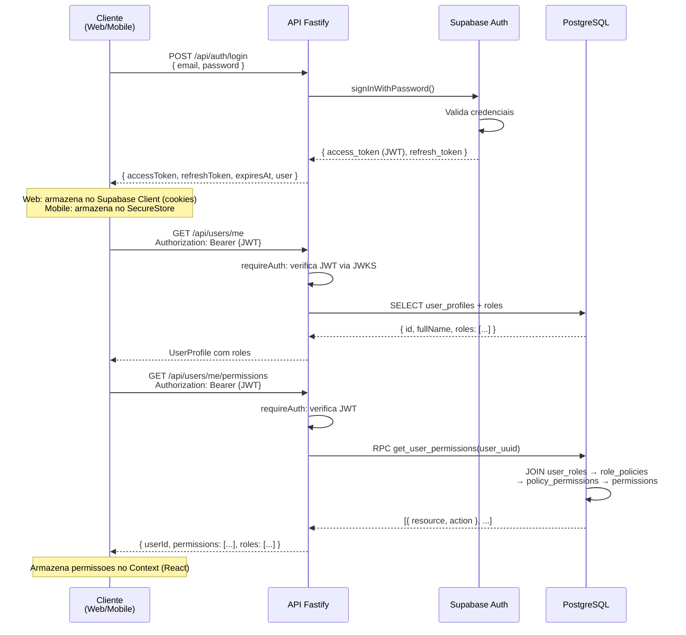
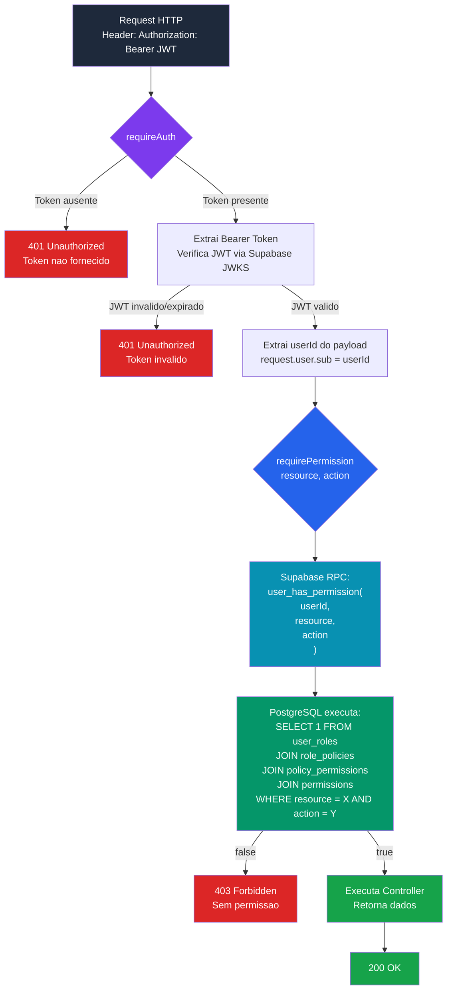
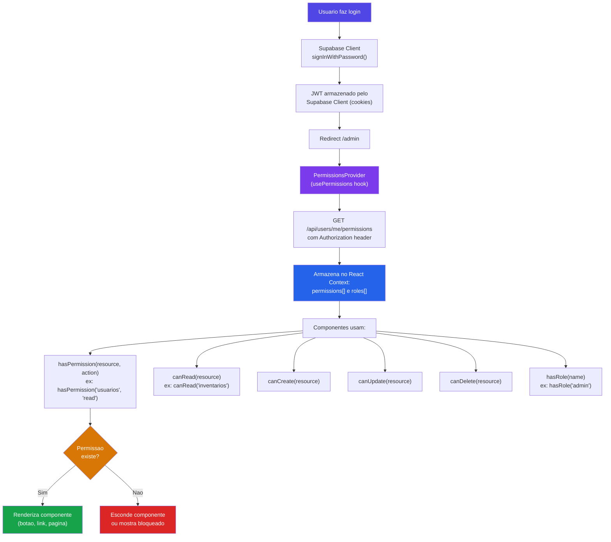
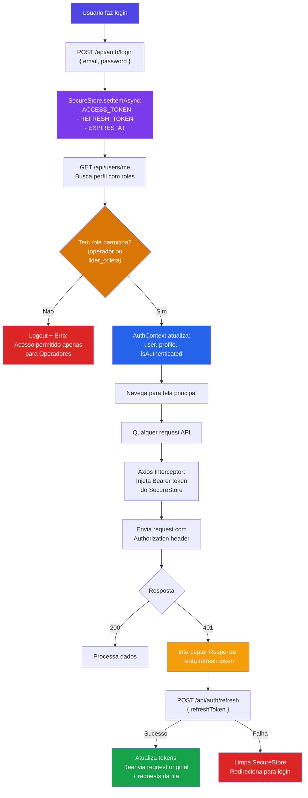
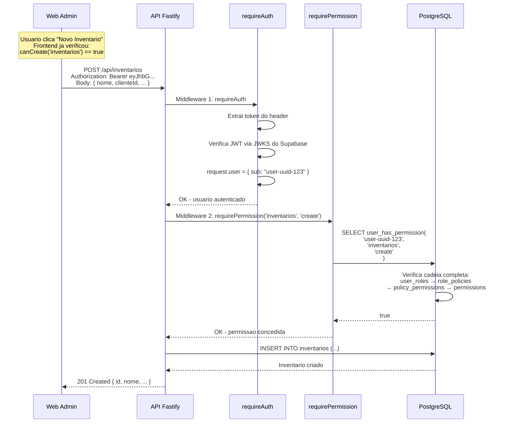
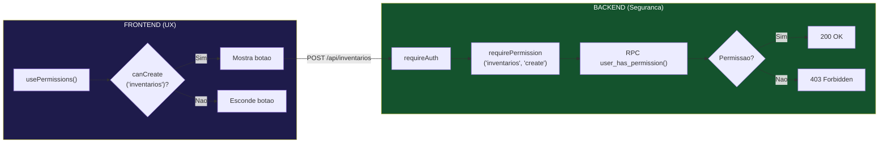

# Sistema de Permissoes - Fluxo Completo

## 1. Modelo de Dados (Banco de Dados)



## 2. Cadeia de Resolucao de Permissoes



## 3. Fluxo de Login e Obtencao de Token



## 4. Fluxo de Autorizacao em Cada Request da API



## 5. Fluxo no Frontend Web (Next.js)



## 6. Fluxo no Mobile (Expo/React Native)



## 7. Exemplo Completo: Criar um Inventario



## 8. O que e Necessario para a Validacao Funcionar

```mermaid
flowchart TD
    subgraph SETUP["CONFIGURACAO INICIAL (uma vez)"]
        direction TB
        S1["1. Criar Permissions no banco<br/>INSERT INTO permissions (resource, action)<br/>ex: ('inventarios', 'create')"]
        S2["2. Criar Policies agrupando permissions<br/>INSERT INTO access_policies (...)<br/>INSERT INTO policy_permissions (...)"]
        S3["3. Criar Roles<br/>INSERT INTO roles (name, display_name)"]
        S4["4. Atribuir Policies as Roles<br/>INSERT INTO role_policies (role_id, policy_id)"]
        S5["5. Atribuir Roles aos Users<br/>INSERT INTO user_roles (user_id, role_id)"]
        S1 --> S2 --> S3 --> S4 --> S5
    end

    subgraph API_SETUP["PROTECAO DAS ROTAS (codigo)"]
        direction TB
        A1["Rota define middlewares:<br/>preHandler: [<br/>  requireAuth,<br/>  requirePermission('recurso', 'acao')<br/>]"]
    end

    subgraph FRONTEND_SETUP["CONTROLE DE UI (codigo)"]
        direction TB
        F1["PermissionsProvider<br/>carrega permissoes do user<br/>no login"]
        F2["Componentes usam hooks:<br/>canCreate('inventarios')<br/>canUpdate('usuarios')"]
        F3["Condicional no JSX:<br/>{canCreate('inventarios') && <br/>  Button 'Novo Inventario' }"]
        F1 --> F2 --> F3
    end

    subgraph RUNTIME["EM TEMPO DE EXECUCAO"]
        direction TB
        R1["Login gera JWT"]
        R2["Frontend carrega permissoes"]
        R3["UI mostra/esconde elementos"]
        R4["Request vai para API"]
        R5["API verifica JWT"]
        R6["API verifica permissao no DB"]
        R7["Acesso concedido ou negado"]
        R1 --> R2 --> R3 --> R4 --> R5 --> R6 --> R7
    end

    SETUP --> API_SETUP
    API_SETUP --> FRONTEND_SETUP
    FRONTEND_SETUP --> RUNTIME

    style SETUP fill:#1e1b4b,color:#fff
    style API_SETUP fill:#172554,color:#fff
    style FRONTEND_SETUP fill:#14532d,color:#fff
    style RUNTIME fill:#431407,color:#fff
```



## 9. Dupla Validacao: Frontend + Backend



> **Importante:** A validacao do frontend e apenas para UX (esconder botoes).
> A **seguranca real** esta no backend - mesmo que alguem burle o frontend,
> a API vai rejeitar com 403 se nao tiver permissao no banco.

## 10. Resumo das Funcoes SQL

| Funcao | Parametros | Retorno | Uso |
|--------|-----------|---------|-----|
| `user_has_permission` | `(user_uuid, resource, action)` | `BOOLEAN` | Middleware `requirePermission` em cada rota |
| `get_user_permissions` | `(user_uuid)` | `TABLE(resource, action)` | Endpoint `GET /api/users/me/permissions` |

Ambas seguem o mesmo caminho:
```
user_roles → role_policies → policy_permissions → permissions
```
